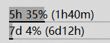

<div align="center">

# Claude Usage Monitor

**Your Claude Code quota — and what every open terminal is doing — right on the Windows taskbar.**

A single self-contained DLL for [TrafficMonitor](https://github.com/zhongyang219/TrafficMonitor).
No Node.js, no browser, no second login.

[](https://github.com/littleji/claude-usage-monitor/releases/latest)
[](https://github.com/littleji/claude-usage-monitor/releases)
[](LICENSE)
[](https://github.com/littleji/claude-usage-monitor/releases/latest)
[](https://github.com/littleji/claude-usage-monitor/stargazers)

**English** | [简体中文](README.zh-CN.md)



</div>

---

## Why

You are deep in a Claude Code session and you want to know two things without breaking flow:

1. **How much quota is left**, and when the window resets.
2. **Which of your six open terminals actually needs you** — one is thinking, one is
   waiting on a permission prompt, one has silently errored out.

Both now live on the taskbar. No alt-tabbing, no `/usage`, no browser tab.

```
● ● ●        5h 21% (1h50m)        7d 47% (3d2h)
 ▲            ▲                     ▲
 three        used in the           used in the
 terminals    5-hour window,        7-day window,
 and their    resets in 1h50m       resets in 3d2h
 states
```

## Features

- **🔋 Live quota on the taskbar** — 5-hour and 7-day windows, percentage used plus a
  live countdown to reset. The countdown ticks every second locally; the API is only
  polled once a minute.
- **🚦 Per-terminal status dots** — one colored dot per running Claude Code terminal:
  🔵 thinking · 🟡 waiting on you · 🟢 done · 🔴 errored · ⚪ idle. *(This is the part no
  other tool has.)*
- **🎨 Threshold coloring + progress bar** — the bar turns yellow at 60% and red at 80%,
  so you can read your budget without reading a number.
- **🔐 Zero extra credentials** — it reuses the login Claude Code already has, makes one
  `GET`, and zeroes the token out of memory right after. Never logged, never cached,
  never shown in the tooltip.
- **📦 One file, no runtime** — a single DLL. HTTPS via the system's WinHTTP, JSON via a
  ~300-line parser in this repo, CRT statically linked. Drop it in `plugins\` and restart.
- **🖱️ Rich tooltip** — absolute reset times, Opus/Sonnet 7-day sub-quotas, extra usage,
  last update time, and the exact reason when a fetch fails.

## How it compares

| | **This plugin** | [cship](https://github.com/stephenleo/cship) | [bemaru plugin](https://github.com/bemaru/trafficmonitor-ai-usage-plugin) |
| --- | --- | --- | --- |
| Data source | OAuth usage API | OAuth usage API | claude.ai page + cookies |
| Runtime deps | **none** | Rust binary | Node.js 22+, Edge/Chrome |
| Login | reuses Claude Code | reuses Claude Code | separate browser login |
| Lives on the taskbar | ✅ | ❌ (terminal) | ✅ |
| Per-terminal status | ✅ | ❌ | ❌ |
| Codex usage | ❌ | ❌ | ✅ |

The DLL name and display-item IDs are distinct from the bemaru plugin, so both can be
installed side by side.

---

## Install

**Prerequisite:** [TrafficMonitor](https://github.com/zhongyang219/TrafficMonitor) is already running.

1. Download **[the latest release](https://github.com/littleji/claude-usage-monitor/releases/latest)**
   and unzip `ClaudeUsageMonitor.dll` into TrafficMonitor's `plugins` folder
   (e.g. `D:\tools\TrafficMonitor\plugins\`).
2. Restart TrafficMonitor. *Claude Usage Monitor* now appears under
   **Options → Plugin Management**.
3. In **Display settings** (configured separately for the main window and the taskbar
   window), tick **Claude 5-hour usage** and **Claude 7-day usage**.

> ⚠️ The DLL's bitness must match `TrafficMonitor.exe` — grab the `x64` zip for the
> normal 64-bit build, `x86` for the 32-bit one.

That's it for the quota items. The **terminal status dots need one extra step** —
see below.

---

## Terminal status dots

The plugin can't see inside the Claude Code process, so Claude Code has to report its own
state. That's what hooks are for: on each event, a small script writes the session's state
to `<CLAUDE_CONFIG_DIR or %USERPROFILE%\.claude>\status\<session_id>.json`, and the plugin
scans that folder once per second. **No extra network requests.**

| Dot | State | When |
| --- | --- | --- |
| ⚪ Gray | Idle | Session opened but nothing submitted yet, or a finished conversation sitting untouched |
| 🔵 Blue | Thinking | A request is in flight and Claude is working |
| 🟡 Yellow | Waiting for you | Claude genuinely needs a decision — permission prompt, MCP input dialog |
| 🟢 Green | Done | The turn finished normally |
| 🔴 Red | Error | The turn was aborted by an API error (rate limit, server error, auth failure) |

Hover the item for a full list: every terminal's state, its working directory, its error
type, and the first 8 characters of its session id. When there are more terminals than
`terminal_max_icons` (default 12), the taskbar shows the first few plus `+N`. When nothing
is running the item reads `No AI running` instead of sitting empty.

### Setting up the hooks

1. The script the hooks call ships in this repo: `tools\claude-hook-status.ps1`.
2. Add this to the `hooks` section of `%USERPROFILE%\.claude\settings.json`, replacing
   `<repo>` with this repository's actual path. If you already have hooks configured,
   append these entries to the matching event arrays rather than replacing the block.

```jsonc
{
  "hooks": {
    "SessionStart": [
      { "hooks": [ { "type": "command", "command": "powershell -NoProfile -ExecutionPolicy Bypass -File \"<repo>\\tools\\claude-hook-status.ps1\" -Event SessionStart" } ] }
    ],
    "UserPromptSubmit": [
      { "hooks": [ { "type": "command", "command": "powershell -NoProfile -ExecutionPolicy Bypass -File \"<repo>\\tools\\claude-hook-status.ps1\" -Event UserPromptSubmit" } ] }
    ],
    "PreToolUse": [
      { "hooks": [ { "type": "command", "command": "powershell -NoProfile -ExecutionPolicy Bypass -File \"<repo>\\tools\\claude-hook-status.ps1\" -Event PreToolUse" } ] }
    ],
    "Notification": [
      { "hooks": [ { "type": "command", "command": "powershell -NoProfile -ExecutionPolicy Bypass -File \"<repo>\\tools\\claude-hook-status.ps1\" -Event Notification" } ] }
    ],
    "Stop": [
      { "hooks": [ { "type": "command", "command": "powershell -NoProfile -ExecutionPolicy Bypass -File \"<repo>\\tools\\claude-hook-status.ps1\" -Event Stop" } ] }
    ],
    "StopFailure": [
      { "hooks": [ { "type": "command", "command": "powershell -NoProfile -ExecutionPolicy Bypass -File \"<repo>\\tools\\claude-hook-status.ps1\" -Event StopFailure" } ] }
    ],
    "SessionEnd": [
      { "hooks": [ { "type": "command", "command": "powershell -NoProfile -ExecutionPolicy Bypass -File \"<repo>\\tools\\claude-hook-status.ps1\" -Event SessionEnd" } ] }
    ]
  }
}
```

3. Restart any Claude Code terminals that are already open — hooks only take effect in
   new sessions.

Every terminal you open now adds a dot. Exiting normally (`/exit`, Ctrl+D) fires
`SessionEnd` and cleans up its state file; killing the window instead is also handled —
the state file records the terminal's PID and the plugin drops it as soon as that process
is gone. Sub-agents spawned by the Task tool are deliberately skipped, so background tasks
don't add phantom dots.

Curious why each of those seven events is needed, or why the dots are hand-drawn with GDI
instead of emoji? See **[docs/internals.md](docs/internals.md)**.

---

## Configuration

`ClaudeUsage.ini` is generated on first run in TrafficMonitor's plugin config directory
(usually `<TrafficMonitor>\plugins\`). Edit it and restart TrafficMonitor to apply.

```ini
[general]
refresh_interval=60

[display]
custom_draw=1
show_bar=1
warn_threshold=60
critical_threshold=80
bar_color_enabled=1
normal_color=9ECE6A
warn_color=E0AF68
critical_color=F7768E
five_hour_label=5h
five_hour_format={pct}% ({reset})
seven_day_label=7d
seven_day_format={pct}% ({reset})
terminal_stale_minutes=360
terminal_max_icons=12
terminal_thinking_color=3B82F6
terminal_idle_color=9E9E9E
```

<details>
<summary><b>All settings explained</b></summary>

| Key | Default | Description |
| --- | --- | --- |
| `refresh_interval` | `60` | Seconds between API requests; allowed range 60–3600 |
| `custom_draw` | `1` | Whether the plugin draws the item itself. Set `0` to fall back to the host's layout, losing threshold colors and the progress bar |
| `show_bar` | `1` | Draw the progress bar under the text. Skipped automatically if the display area is too short |
| `warn_threshold` | `60` | Percentage at which the bar turns to the warning color |
| `critical_threshold` | `80` | Percentage at which the bar turns to the critical color |
| `bar_color_enabled` | `1` | Color the bar by threshold. Set `0` to make it match the text color |
| `normal_color` | `9ECE6A` | Normal color, `RRGGBB` hex |
| `warn_color` | `E0AF68` | Warning color, also used by the 🟡 "waiting" dot |
| `critical_color` | `F7768E` | Critical color, also used by the 🔴 "error" dot |
| `*_label` | `5h` / `7d` | Item prefix. Leave empty to show only the value |
| `*_format` | `{pct}% ({reset})` | Value format string, see below |
| `terminal_stale_minutes` | `360` | A state file untouched this long is treated as a dead session |
| `terminal_max_icons` | `12` | Max dots on the taskbar; the rest collapse into `+N` |
| `terminal_thinking_color` | `3B82F6` | Color of the 🔵 "thinking" dot |
| `terminal_idle_color` | `9E9E9E` | Color of the ⚪ "idle" dot |

The 🟢 "done" dot reuses `normal_color` — these are the same colors the usage bar uses, so
changing one affects both places.

The text color always follows the skin's foreground color and never changes with the
threshold: red or yellow text on a light background blurs together and is hard to read at
a glance. Threshold coloring shows up in the bar only.

</details>

### Format strings

| Placeholder | Meaning | Example |
| --- | --- | --- |
| `{pct}` | Percentage used, rounded | `21` |
| `{remaining}` | Percentage remaining, rounded | `79` |
| `{reset}` | Time until reset | `4h19m` |
| `{reset_at}` | Local wall-clock reset time | `19:42` or `08-19 09:00` |

```ini
five_hour_format={pct}% ({reset})      ; 5h 21% (4h19m)   default
five_hour_format={pct}% · {reset}      ; 5h 21% · 4h19m   narrower
five_hour_format={pct}%                ; 5h 21%           just the quota
five_hour_format={remaining}% left     ; 5h 79% left      "how much is left" framing
five_hour_format={pct}% →{reset_at}    ; 5h 21% →19:42    absolute reset time
```

The item's width is computed from the worst case (`100%`, `23h59m`), so it stays stable
and doesn't jitter as the value changes.

The remaining time renders as `45m` under an hour, `4h12m` under a day, `3d2h` beyond
that, `?` if the API returned no reset time, and `now` if it has already passed. The value
itself shows `--` before the first successful fetch and `N/A` when the API doesn't return
that window (some Enterprise accounts).

**Double-click** the item to refresh immediately, or pick *Refresh usage now* from the
plugin's right-click menu.

---

## Troubleshooting

`Probe.exe` (built from source, see below) runs the exact same fetch-and-format code as
the plugin but prints to the console. It never prints the token.

```powershell
.\build\x64-Release\Probe.exe --selftest   # offline: JSON, ISO8601, time formatting
.\build\x64-Release\Probe.exe              # hit the API and print usage
```

| Message | Cause and fix |
| --- | --- |
| Credentials file not found | Not logged into Claude Code yet, or `CLAUDE_CONFIG_DIR` points elsewhere |
| Can't read `claudeAiOauth.accessToken` | Credentials file format doesn't match — log into Claude Code again |
| Access token expired (HTTP 401) | Log into Claude Code again. The plugin deliberately doesn't refresh the token itself — renewal is Claude Code's job |
| Too many requests (HTTP 429) | See below |
| Cannot connect to api.anthropic.com | Network/proxy issue. The plugin uses WinHTTP, which respects the system proxy |

<details>
<summary><b>About HTTP 429</b></summary>

`/api/oauth/usage` rate-limits **before authentication** — even a request with no
`Authorization` header at all comes back as:

```json
{ "error": { "type": "rate_limit_error", "message": "Rate limited. Please try again later." } }
```

So this has nothing to do with whether your token is valid. It means the endpoint's quota
for your current egress IP / account is used up — Claude Code, cship, and any other usage
script on the same account all draw from it.

Notably, **running `Probe.exe` while TrafficMonitor already has the plugin loaded usually
gets a 429**, since they share that quota. Quit TrafficMonitor first, or just read the
plugin's tooltip. To confirm the plugin isn't at fault:

```powershell
Invoke-WebRequest https://api.anthropic.com/api/oauth/usage -SkipHttpErrorCheck | Select-Object StatusCode
```

If that returns 429 with no credentials attached, you just have to wait it out. The plugin
backs off automatically (30s, doubling, capped at 10 minutes) and keeps the last good data
on screen meanwhile.

Some proxies block on User-Agent; override it with
`$env:CLAUDE_USAGE_MONITOR_UA = "ureq/3.1.2"` (default is `TrafficMonitor-ClaudeUsage/1.0`).

</details>

<details>
<summary><b>Previewing colors without hitting 60% / 80%</b></summary>

Set `CLAUDE_USAGE_MONITOR_DEMO` to feed percentages in directly, bypassing the API:

```powershell
$env:CLAUDE_USAGE_MONITOR_DEMO = "85,42"   # 5h at 85% (critical), 7d at 42% (normal)
.\build\x64-Release\Probe.exe
```

To preview inside TrafficMonitor, set it as a system environment variable, restart
TrafficMonitor, tune your format and colors, then remove it.

</details>

---

## Build from source

Only the Visual Studio 2022 MSVC C++ toolchain is needed — no MFC, no CMake, no Node.js.

```powershell
.\build.ps1                          # x64 Release, output to build\x64-Release\
.\build.ps1 -Arch x86                # 32-bit
.\build.ps1 -Config Debug            # with debug info
.\build.ps1 -Install <plugins dir>   # install right after building
.\build.ps1 -Arch all -Zip           # release zips for both architectures
```

This produces `ClaudeUsageMonitor.dll` (the plugin), `Probe.exe` (the command-line probe)
and `HostTest.exe` (which loads the DLL exactly the way TrafficMonitor does and drives it
through a full lifecycle, including pixel-level checks of the custom drawing). You can
also open `ClaudeUsageMonitor.sln` in Visual Studio, though it won't build the two tools.

---

## Where the data comes from

```
%USERPROFILE%\.claude\.credentials.json        (or $CLAUDE_CONFIG_DIR)
        │  reads claudeAiOauth.accessToken
        ▼
GET https://api.anthropic.com/api/oauth/usage
        Authorization: Bearer <token>
        anthropic-beta: oauth-2025-04-20
        │
        ▼
{ "five_hour":  { "utilization": 21.0, "resets_at": "..." },
  "seven_day":  { "utilization": 47.5, "resets_at": "..." },
  "seven_day_opus": { ... }, "seven_day_sonnet": { ... },
  "extra_usage": { "is_enabled": true, "monthly_limit": ..., ... } }
```

The access token lives only as a local variable for the duration of one request and is
wiped with `SecureZeroMemory` immediately after. It is never written to a config file,
cache, or log, and never appears in the tooltip. The plugin only ever issues that one GET
and never modifies any Claude Code file.

For the architecture, the design trade-offs, and the reasoning behind each hook event, see
**[docs/internals.md](docs/internals.md)**.

---

## Contributing

Issues and pull requests are welcome — bug reports, TrafficMonitor skin quirks, and
format-string ideas especially. If the plugin is useful to you, a ⭐ helps other Claude
Code users find it.

## Credits

- [TrafficMonitor](https://github.com/zhongyang219/TrafficMonitor) — the host program.
- [cship](https://github.com/stephenleo/cship) — the source of the fetch approach, the
  time formats, and the default color thresholds.

## License

MIT
